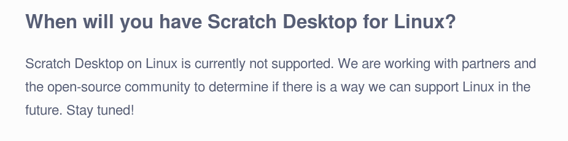

# Scratch 3
Srovnání Scratch 3 a jeho předchůdce Scratch 2 (ke dni 11. 2. 2019).

## Nevýhody
Seznam několika věcí, které jsou proti původní verzi spíše krokem vzad či jde o chyby, které však společně často brání rozumné výuce v tomto jazyce.

### Grafický editor
### Velké příkazy
Scratch 3 je na rozdíl od Scratch 2 přizpůsoben běhu na všech možných zařízeních, tedy i na dotykových jako jsou tablety nebo mobilní telefony. To znamená, že příkazy musí být dostatečně velké i pro ovládání prstama dětí. To bohužel významně zhoršilo přehlednost pro práci na počítči/notebooku. Příkazů se na obrazovku vejde významně méně, větší programy se nově tvoří velmi obtížně.

Výsledek se příliš nezlepší, když si stránku Scratch 3 zmenšíme, protože se písmo rychle stane nečitelné.

### České překlady
### Chyby

### Offline editor
Ač se to zdá neuvěřitelné, stále všude není dostupný pevný internet a nebo na něj nelze spoléhat (při větším počtu připojených počítačů lehne router a podobně). Zvláště když děláme nějaké terénní akce, kde spoléháme na cizí připojení, je to obtížné. Offline editor tak byl a je důležitou součástí našich hodin i akcí. Protože máme učebnu vybavenou nízkonákladově, všechny počítače jedou na Linuxu. Nově však [Offline editor Linux nepodporuje](https://scratch.mit.edu/download), dostupné jsou zatím jen neoficiální (a trochu neohrabané) porty.

### UI
### Seznamy
### Ukládání

## Výhody

